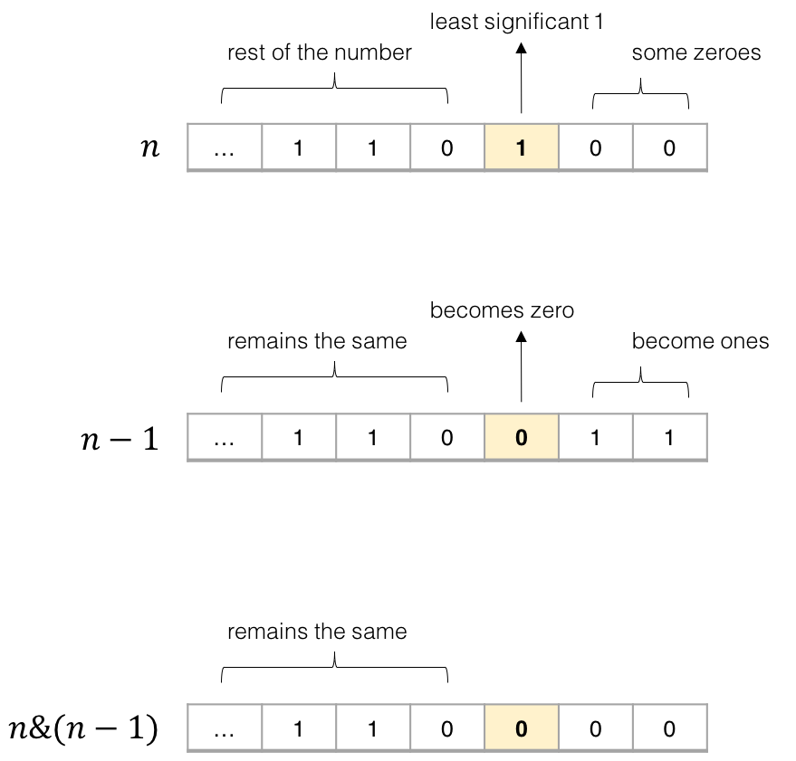

# 2026年1月22日

## #191 位1的个数

**【题目描述】**
给定一个正整数 n，编写一个函数，获取一个正整数的二进制形式并返回其二进制表达式中 设置位 的个数（也被称为汉明重量）。

**【关键词】**
位操作

**【核心技巧】**
1. 最容易想到的办法，肯定还是直观地统计二进制中每一位是否包含 1 。 
 做法是：
- 使用 n & 1 得到二进制末尾是否为 1；
- 把 n 右移 1 位，直至结束。

2. n & (n - 1) ，这个代码可以把 n 的二进制中，最后一个出现的 1 改写成 0。 
   只要每次执行这个操作，就会消除掉 n 的二进制中 最后一个出现的 1。 
   因此执行 n & (n - 1) 使得 n 变成 0 的操作次数，就是 n 的二进制中 1 的个数。 
   

**【相似题目】**

**【用时】**
15分钟 ✓ 完成

**【超有用小技巧】**

**【个人的感受】**
 处理末尾，再右移这个操作出现第二次了