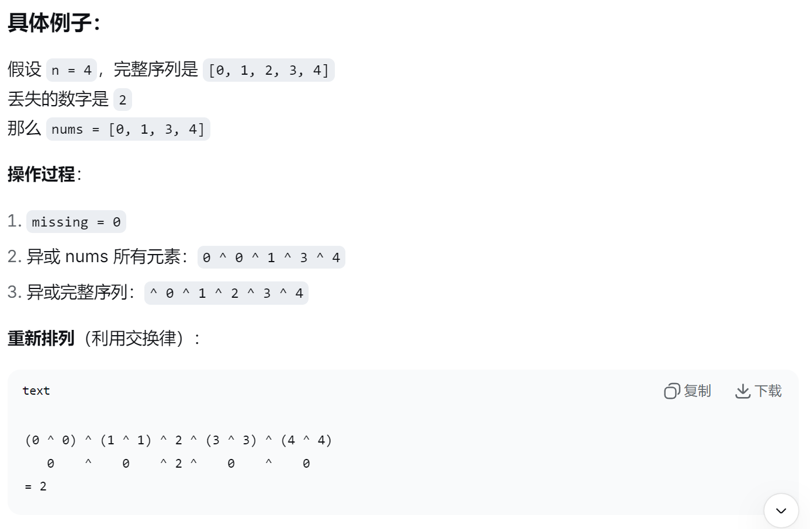

## #268 丢失的数字

**【题目描述】**
给定一个包含 [0, n] 中 n 个数的数组 nums ，找出 [0, n] 这个范围内没有出现在数组中的那个数。

**【关键词】**
位操作，异或

**【核心技巧】**
1. 将数组排序之后，即可根据数组中每个下标处的元素是否和下标相等，得到丢失的数字。<br>
 由于数组的长度是 n，因此下标范围是 [0,n−1]。假设缺失的数字是 k，分别考虑以下两种情况：
  - 当 0≤k<n 时，对任意 0≤i<k，都有 nums[i]=i，由于 k 缺失，因此 nums[k]=k+1，k 是第一个满足下标和元素不相等的下标；
  - 当 k=n 时，0 到 n−1 都没有缺失，因此对任意 0≤i<n，都有 nums[i]=i。

1. 异或
   ```text
   a ^ a = 0（相同数字异或得0）
   a ^ 0 = a
   异或满足交换律和结合律
   ```
   - 初始化结果：missing = 0
   - 异或所有数组元素：missing ^= nums[i]
   - 异或完整序列：missing ^= i（i 从 0 到 n）<br>
   

**【相似题目】**


**【用时】**
15分钟 ✓ 完成

**【超有用小技巧】**


**【个人的感受】**
 异或这小子，在找缺失数和只出现一次的数很行