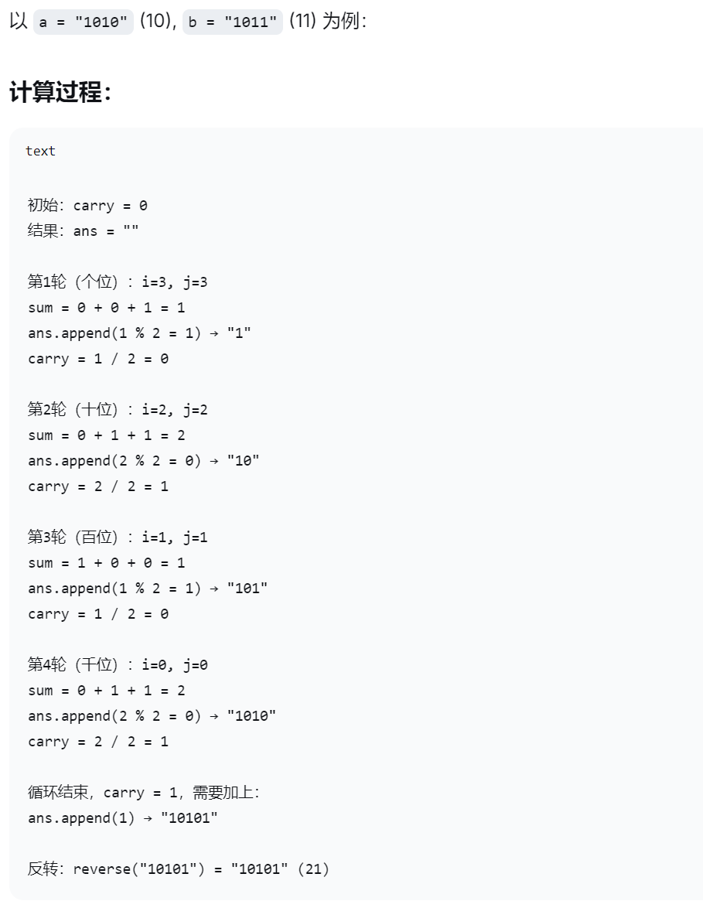

## #67 二进制求和

**【题目描述】**
给你两个二进制字符串 a 和 b ，以二进制字符串的形式返回它们的和。

**【关键词】**
位操作，字符串

**【核心技巧】**
整体思路是将两个字符串较短的用 0 补齐，使得两个字符串长度一致，然后`从末尾进行遍历计算`，得到最终结果。

本题解中大致思路与上述一致，但由于字符串操作原因，不确定最后的结果是否会多出一位`进位`，所以会有 2 种处理方式：
- 第一种，在进行计算时直接拼接字符串，会得到一个反向字符，需要最后再进行翻转
- 第二种，按照位置给结果字符赋值，最后如果有进位，则在前方进行字符串拼接添加进位
时间复杂度：O(n)

**【相似题目】**

**【用时】**
15分钟 ✓ 完成

**【超有用小技巧】**

**【个人的感受】**
可以早起玩手机，但别熬夜玩手机！真的很困