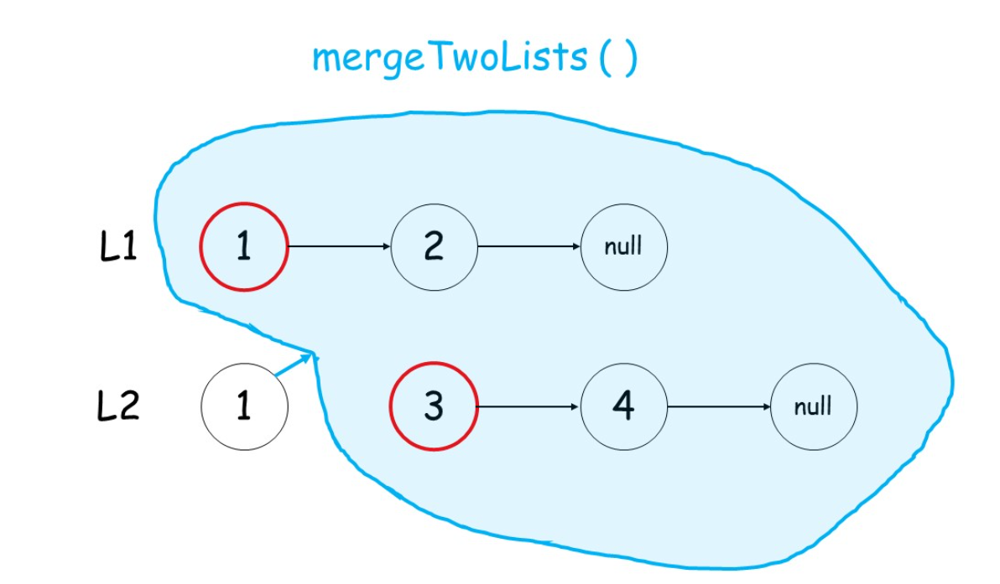

## #67 二进制求和

**【题目描述】**
将两个升序链表合并为一个新的 升序 链表并返回。新链表是通过拼接给定的两个链表的所有节点组成的。

**【关键词】**
链表，递归

**【核心技巧】**
- 终止条件：当两个链表都为空时，表示我们对链表已合并完成。
- 如何递归：我们判断 l1 和 l2 头结点哪个更小，然后较小结点的 next 指针指向其余结点的合并结果。（调用递归）

**【相似题目】**

**【用时】**
15分钟 ✓ 完成

**【超有用小技巧】**

**【个人的感受】**
其实这个题之前就做过了，思路有，但是有我自己完全写出代码还真不一定，还是写少了，小老弟