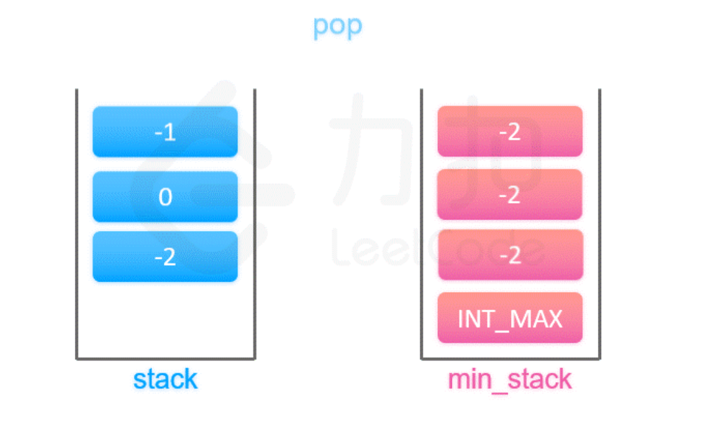

## #155 最小栈

**【题目描述】**
设计一个支持 push ，pop ，top 操作，并能在常数时间内检索到最小元素的栈。

实现 MinStack 类:

MinStack() 初始化堆栈对象。
void push(int val) 将元素val推入堆栈。
void pop() 删除堆栈顶部的元素。
int top() 获取堆栈顶部的元素。
int getMin() 获取堆栈中的最小元素。

**【关键词】**
栈与辅助栈

**【核心技巧】**

1. 当一个元素要入栈时，我们取当前辅助栈的栈顶存储的最小值，与当前元素比较得出最小值，将这个最小值插入辅助栈中；
2. 当一个元素要出栈时，我们把辅助栈的栈顶元素也一并弹出；
3. 在任意一个时刻，栈内元素的最小值就存储在辅助栈的栈顶元素中。

**【相似题目】**

**【用时】**
15分钟 ✓ 完成

**【超有用小技巧】**

**【个人的感受】**