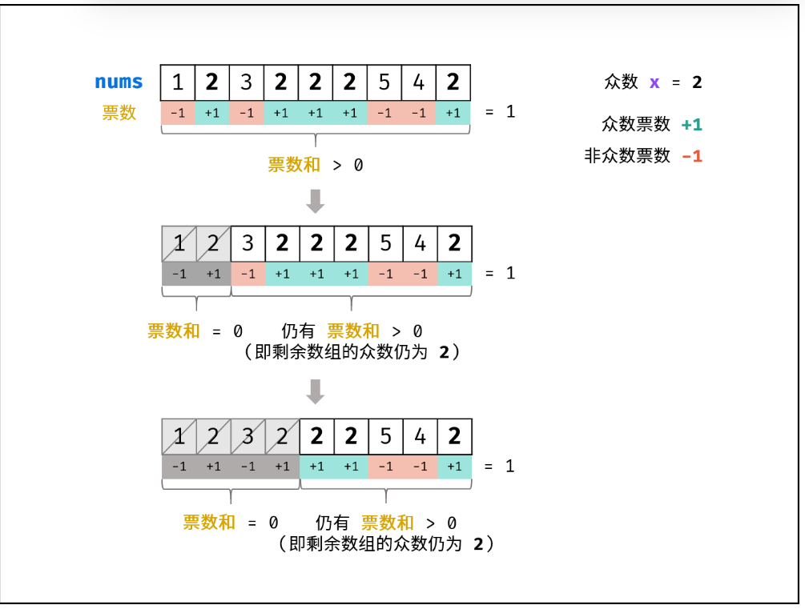

## #169 多数元素

**【题目描述】**
给定一个大小为 n 的数组 nums ，返回其中的多数元素。多数元素是指在数组中出现次数 大于 ⌊ n/2 ⌋ 的元素。

你可以假设数组是非空的，并且给定的数组总是存在多数元素。

**【关键词】**
统计，投票

**【核心技巧】**
因为多数元素肯定只有一个，所以就能分成两类了，

推论一： 若记 众数 的票数为 +1 ，非众数 的票数为 −1 ，则一定有所有数字的 票数和 >0 。

推论二： 若数组的前 a 个数字的 票数和 =0 ，则 数组剩余 (n−a) 个数字的 票数和一定仍 >0 ，即后 (n−a) 个数字的 众数仍为 x 。

算法流程:
1. 初始化： 票数统计 votes = 0 ， 众数 x。
2. 循环： 遍历数组 nums 中的每个数字 num 。
- 当 票数 votes 等于 0 ，则假设当前数字 num 是众数。
- 当 num = x 时，票数 votes 自增 1 ；当 num != x 时，票数 votes 自减 1 。
3. 返回值： 返回 x 即可。

**【相似题目】**

**【用时】**
15分钟 ✓ 完成

**【复杂度分析】**
- 时间复杂度 O(N) ： N 为数组 nums 长度。
- 空间复杂度 O(1) ： votes 变量使用常数大小的额外空间。

**【个人的感受】**
>只要是能分成两类的，需要找一类的，这个摩尔投票法应该都挺好用的