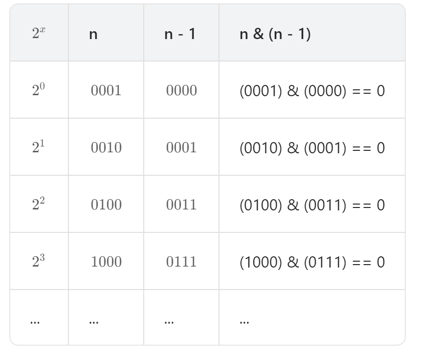

## #232 2的幂

**【题目描述】**
给你一个整数 n，请你判断该整数是否是 2 的幂次方。如果是，返回 true ；否则，返回 false 。

如果存在一个整数 x 使得 n == $2^x$  ，则认为 n 是 2 的幂次方。

**【关键词】**
位运算

**【核心技巧】**
#### 一、位运算
若 n=$2^x$ ，且 x 为自然数（即 n 为 2 的幂），则一定满足以下条件：

1. 恒有 n & (n - 1) == 0，这是因为：
  - n 二进制最高位为 1，其余所有位为 0；
  - n−1 二进制最高位为 0，其余所有位为 1；
2. 一定满足 n > 0。

因此，通过 n > 0 且 n & (n - 1) == 0 即可判定是否满足 n=$2^x$ 。

#### 二、笨方法 —— 最直观的循环除以2
- 时间复杂度：O(log n)	
- 空间复杂度：O(1)

**【相似题目】**
day 48-191

**【用时】**
15分钟 ✓ 完成

**【复杂度分析】**

**一、时间复杂度**

详细分析：

1. 操作次数：
   - 代码中只有一次位运算：`n & (n - 1)`
   - 一次比较运算：`n > 0`
   - 一次逻辑与运算：`&&`
   - 一次等于比较：`== 0`

2. 关键点：
   - 没有循环
   - 没有递归
   - 所有操作都是常数时间内完成

3. 总时间复杂度：O(1)
   - 无论输入 n 的大小，执行的操作数量固定
   - 最坏情况：O(1)
   - 最好情况：O(1) 
   - 平均情况：O(1)

**二、空间复杂度**

详细分析：

1. 内存使用情况：
   - 输入参数：int n（不算在内，是输入）
   - 函数内部：没有创建新的变量
   - 没有使用额外的数组或数据结构

2. 关键点：
   - 只有栈上存储的返回值
   - 没有动态分配内存

3. 总空间复杂度：O(1)
   - 空间使用与输入规模 n 无关
   - 只使用固定数量的内存

**【个人的感受】**
1. 讨厌写markdown

