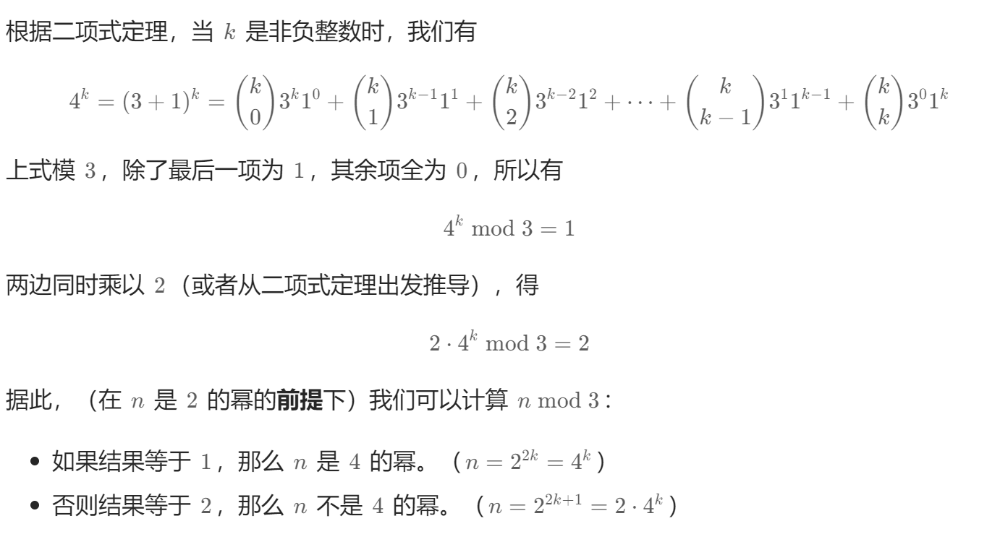

## #342 4的幂

**【题目描述】**
给你一个整数 n，请你判断该整数是否是 4 的幂次方。如果是，返回 true ；否则，返回 false 。

如果存在一个整数 x 使得 n == $4^x$，则认为 n 是 4 的幂次方。

**【关键词】**
位运算 | 数学

**【核心技巧】**

#### 一、位运算 + 数学性质

若 n = $4^x$，则 n 一定是 2 的幂，且满足以下条件：

1. **必须是 2 的幂**：`n > 0` 且 `n & (n - 1) == 0`
2. **4 的幂的二进制特征**：唯一的 1 出现在偶数位上（从第 0 位开始数）
   - 例如：1（1）、4（100）、16（10000）、64（1000000）
   - 这些数的二进制表示中，1 的位置索引是 0, 2, 4, 6...（偶数位）
   - 可以构造掩码 `0x55555555`（二进制 01010101...），4 的幂与该掩码按位与后结果不为 0

因此，判定条件为：
```
n > 0 && (n & (n - 1)) == 0 && (n & 0x55555555) != 0
```

#### 二、数学方法 —— 模运算

4 的幂模 3 一定等于 1：
- $4^x \mod 3 = (3+1)^x \mod 3 = 1^x \mod 3 = 1$
- 反之，2 的幂模 3 可能是 1 或 2




因此，可先判定是 2 的幂，再检查 `n % 3 == 1`。

```
n > 0 && (n & (n - 1)) == 0 && n % 3 == 1
```

#### 三、笨方法 —— 循环除以4
- 时间复杂度：O(log n)
- 空间复杂度：O(1)

---

**【相似题目】**
day 48-191（位1的个数）
day 67-232（2的幂）

---

**【用时】**
12分钟 ✓ 完成

---

**【复杂度分析】**

**一、时间复杂度**

详细分析：

1. 操作次数：
   - 代码中只有两次位运算：`n & (n - 1)` 和 `n & 0x55555555`
   - 两次比较运算：`n > 0`、`!= 0`
   - 两次逻辑与运算：`&&`
   - 一次等于比较：`== 0`

2. 关键点：
   - 没有循环
   - 没有递归
   - 所有操作都是常数时间内完成

3. 总时间复杂度：**O(1)**
   - 无论输入 n 的大小，执行的操作数量固定

**二、空间复杂度**

详细分析：

1. 内存使用情况：
   - 输入参数：int n（不算在内，是输入）
   - 函数内部：没有创建新的变量
   - 没有使用额外的数组或数据结构

2. 关键点：
   - 只有栈上存储的返回值
   - 没有动态分配内存

3. 总空间复杂度：**O(1)**
   - 空间使用与输入规模 n 无关
   - 只使用固定数量的内存

---

**【个人的感受】**
1. 2 的幂是基础，4 的幂是在 2 的幂基础上增加了位模式的约束
2. 掩码 `0x55555555` 是解题关键，记住这个模式对处理其他 2^k 的幂也有帮助
3. 模 3 的方法更数学化，但位运算方法更接近计算机本质

