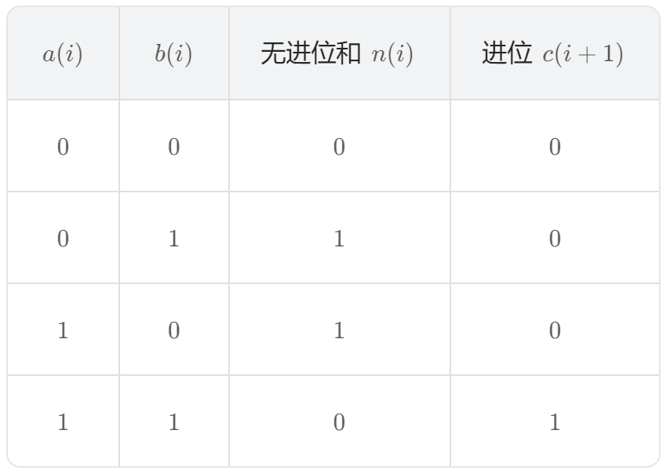

## #371 两整数之和

**【题目描述】**
给你两个整数 a 和 b，不使用运算符 + 和 -，计算并返回两整数之和。

**【关键词】**
位运算 | 加法器原理

---

**【核心技巧】**

#### 一、位运算 —— 无进位加法 + 进位处理

计算机底层加法器的实现原理（就是数电的知识）：

1. **无进位加法**（异或运算 ⊕）
   - `a ^ b` 得到的是`不考虑进位的相加结果`
   - 0⊕0=0，0⊕1=1，1⊕0=1，1⊕1=0


2. **进位计算**（与运算 + 左移）
   - `(a & b) << 1` 得到的是进位产生的值
   - 因为只有两位都是1时才会产生进位，进位要加到更高一位上

  

1. **循环迭代**
   - 将无进位结果赋值给 a
   - 将进位结果赋值给 b
   - 重复直到进位为 0


**示例：** 计算 3 + 2 = 5
- 3 (011) ⊕ 2 (010) = 001（无进位和）
- 3 & 2 = 010，左移1位得 100（进位）
- 下一轮：001 ⊕ 100 = 101（5）
- 001 & 100 = 000，进位为0，结束

#### 二、递归写法

基于同样的原理，用递归简洁表达：
```
int getSum(int a, int b) {
    return b == 0 ? a : getSum(a ^ b, (a & b) << 1);
}
```

#### 三、Python 特殊处理（32位整数模拟）

Python 整数无位数限制，需手动模拟 32 位整型溢出：
```
def getSum(self, a: int, b: int) -> int:
    # 32 位掩码
    mask = 0xFFFFFFFF
    
    while b & mask:
        carry = (a & b) << 1
        a = a ^ b
        b = carry
    
    # 处理负数情况
    return a & mask if a > 0x7FFFFFFF else a
```

---

**【相似题目】**
day 67-232（2的幂，位运算基础）
面试题 17.01. 不用加号的加法
67. 二进制求和

---

**【用时】**
15分钟 ✓ 完成

---

**【复杂度分析】**

**一、时间复杂度**

详细分析：

1. 操作次数：
   - 每次循环执行两次位运算和一次左移
   - 循环次数取决于进位传播的位数

2. 关键点：
   - 进位最多传播到最高位
   - 对于 32 位整数，最多循环 32 次 ， 循环次数 ≈ 二进制位数 = log₂(n)
   - 对于任意整数，循环次数 O(log(max(a,b)))

3. 总时间复杂度：**O(log n)**
   - 最坏情况：O(32) ≈ O(1)（对于固定位数）
   - 理论上：O(log(max(a,b)))

**二、空间复杂度**

详细分析：

1. 内存使用情况：
   - 输入参数：int a, int b（不算在内）
   - 函数内部：只创建了临时变量 carry
   - 没有使用额外的数组或数据结构

2. 关键点：
   - 迭代写法：只使用固定数量的变量
   - 递归写法：递归深度 O(log n)，栈空间 O(log n)

3. 总空间复杂度：
   - 迭代写法：**O(1)**
   - 递归写法：**O(log n)**

---

**【个人的感受】**
1. 这道题完美诠释了计算机底层的加法原理：异或求和无进位加，与运算求进位
2. 左移进位是精髓——进位不会留在原位，而要进到更高位
3. Python 的无限精度整数反而增加了处理难度，需要手动掩码截断
4. 位运算不是“炫技”，而是理解计算机本质的钥匙
5. 主要的理解就是：a + b = 无进位和 + 进位，它可以一位一位进行，但这里是同时进行，运算结束的标准就是进位结束